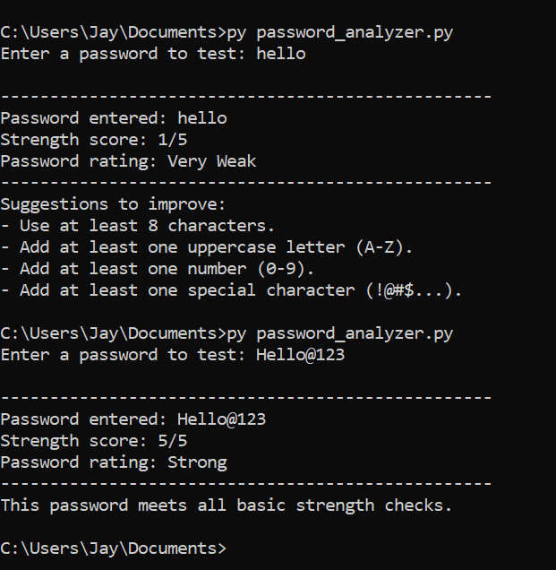

# Password Strength Analyzer

A beginner-friendly Python project that evaluates password strength using rule-based checks and provides suggestions for improvement.

## Purpose
This project was built to understand how password security can be assessed using simple validation rules such as length, lowercase letters, uppercase letters, numbers, and special characters.

## Features
- Checks minimum password length.
- Detects lowercase letters.
- Detects uppercase letters.
- Detects numeric digits.
- Detects special characters.
- Rates the password as Very Weak, Weak, Medium, Good, or Strong.
- Suggests how the password can be improved.

## How It Works
The script uses Python's `re` module to search for patterns in a user-provided password.

It assigns a score based on whether the password satisfies these checks:
- At least 8 characters
- At least one lowercase letter
- At least one uppercase letter
- At least one number
- At least one special character

Based on the total score, the script prints a strength rating and improvement tips.

## Example Use
This project can be used to understand the basic logic behind password policy checks and secure password creation.

## Sample Output

## Ethical Note
This project is designed for educational purposes only. It does not store passwords or connect to external systems.

## Concepts Practiced
- Python regular expressions
- Input validation
- Rule-based security checks
- Conditional logic
- User feedback design

## Future Improvements
- Detect repeated-character patterns
- Estimate password entropy
- Create a GUI version
- Test multiple passwords from a file
- Export results for analysis

## Author
Jay Prakash  
GitHub: [jayprakash-tech](https://github.com/jayprakash-tech)
